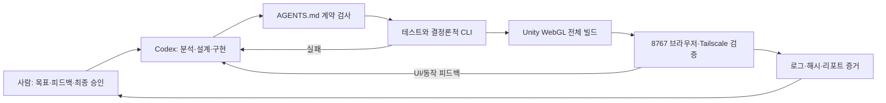
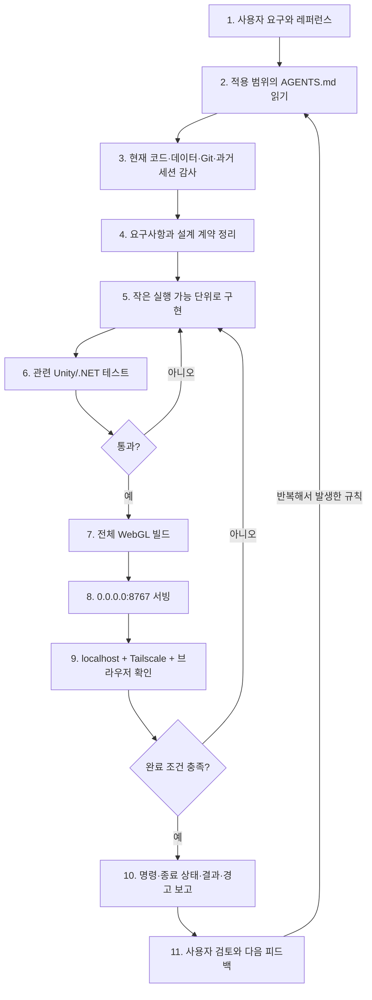
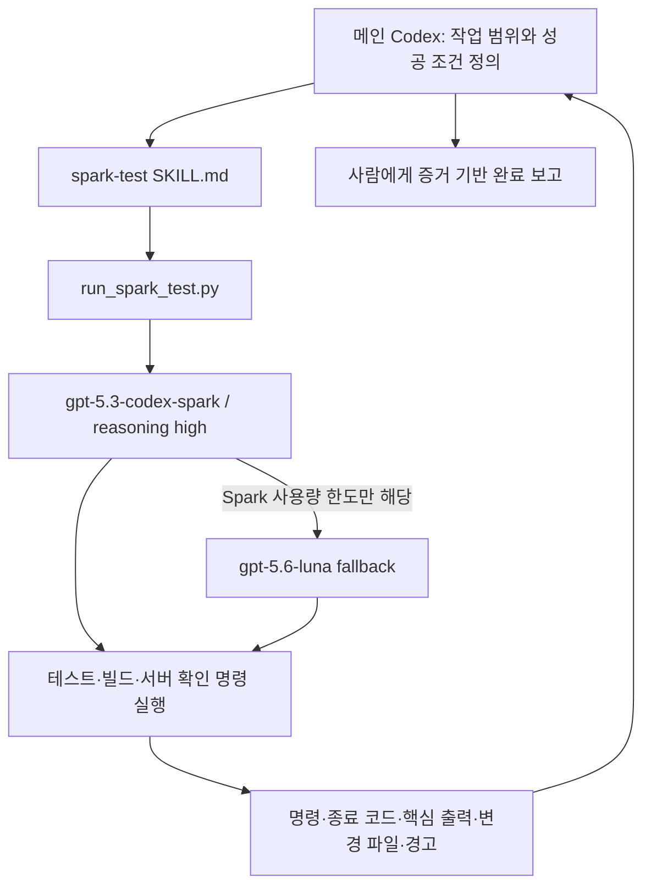
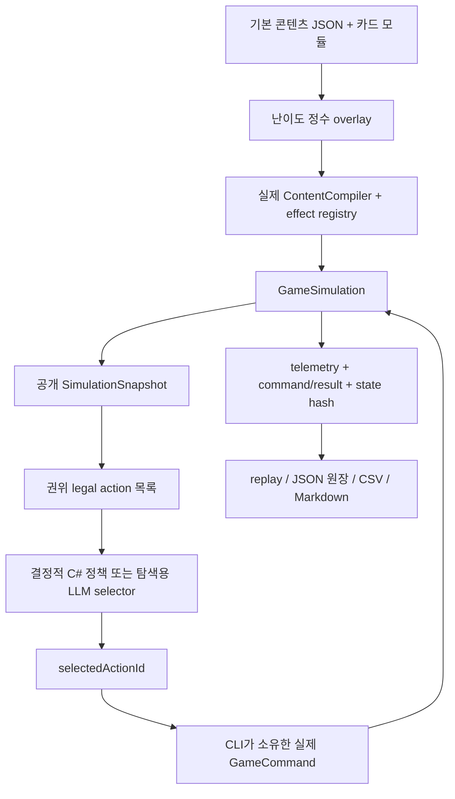
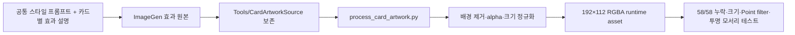

# NAN 2026 AI 활용 기술 문서

> 문서 상태: 제출 전 초안 v0.2
> 작성 기준일: 2026-08-09
> 프로젝트: Ruleforge TD
> 제출 형식 예정: PDF
> 주의: 이 문서는 내용 검토를 위한 Markdown 초안이다. 팀명, 참가자, 공개 빌드 URL, 플레이 영상 URL, 최종 테스트 수치는 PDF 편집 단계에서 확정한다.

| 항목 | 내용 |
| --- | --- |
| 프로젝트명 | Ruleforge TD |
| 장르 | 카드 조립형 로그라이트 타워 디펜스 |
| 실행 환경 | Unity WebGL / 웹 브라우저 |
| 소스 저장소 | <https://github.com/wl39/NAN-Ruleforge-TD> |
| 핵심 AI 활용 | Codex 기반 설계·구현·리뷰, `AGENTS.md` 워크플로우, 직접 제작한 `spark-test` skill, ImageGen 기반 시각 자산 제작, AI 활용을 전제로 설계한 결정론적 밸런스 CLI, 제공 음원의 파형·박자 분석과 상태 기반 BGM 구현 |
| 최종 책임 | 기획 방향·에셋 선택·수치 승인·출시 판단은 사람이 수행 |

## 1. 요약

Ruleforge TD는 타워가 실행 조건과 대상을 정하고, 플레이어가 카드 순서를 조립해 전투 규칙을 만드는 Unity WebGL 게임이다. 이 프로젝트에서 AI는 단발성 코드 자동완성 도구가 아니라, 요구사항 정리부터 구조 설계, 구현, 테스트, 브라우저 검증, 밸런스 실험, 문서화까지 이어지는 개발 워크플로우의 협업자로 사용되었다.

가장 중요한 특징은 AI의 출력을 곧바로 정답으로 간주하지 않았다는 점이다. 프로젝트의 제품 원칙과 완료 조건은 저장소의 `AGENTS.md`에 기록했고, 반복 작업은 직접 만든 `spark-test` skill로 분리했다. 밸런스 판단은 실제 게임 로직을 공유하는 순수 .NET CLI에서 고정 시드로 재현했으며, AI 제안은 허용된 데이터 범위와 통계 검증을 통과한 경우에만 후보로 취급했다. 실제 최종 밸런스 평가에서는 실패한 gate를 숨기지 않고 `RELEASE NOT READY`, 자동 적용 0건으로 기록했다.

이 문서의 핵심 주장은 다음 세 가지다.

1. `AGENTS.md`를 프로젝트의 지속적인 개발 계약으로 사용해 여러 Codex 세션이 같은 설계 원칙과 완료 기준을 따르게 했다.
2. 직접 만든 `spark-test` skill로 구현과 검증의 역할을 분리하고, 테스트·빌드·서빙 결과를 증거 형식으로 회수했다.
3. AI가 밸런스 수치를 임의로 정하지 않도록 실제 `GameSimulation`, 합법 행동, replay, 고정 seed partition을 사용하는 전용 CLI를 구축했다.

## 2. AI 활용 범위와 역할 분담

AI 활용은 사람의 기획과 책임을 대체하지 않고, 반복 가능한 구현·검증 루프를 확장하는 방향으로 설계했다.

| 단계 | 사람이 담당한 일 | AI가 담당한 일 | 기계적으로 검증한 일 |
| --- | --- | --- | --- |
| 문제 정의 | 게임 콘셉트, 재미의 방향, UI 피드백, 난이도 체감 제시 | 요구사항 구조화, 영향 범위 분석, 대안 제안 | 기존 코드·데이터·세션 기록 대조 |
| 설계 | 핵심 원칙 승인, 우선순위와 범위 결정 | 아키텍처, 데이터 계약, 모듈 경계, 예외·안전장치 설계 | 컴파일러 검증, 테스트 케이스, 정적 검사 |
| 구현 | 결과 확인과 수정 지시 | Unity/C#, .NET CLI, Python 자산 처리 도구, 음원 구간 분석, 문서 구현 | EditMode, PlayMode, .NET test harness |
| 시각 제작 | 레퍼런스·톤·사용 에셋 선택 | ImageGen 초안, UI/카드 시각 후보 생성 | 크기·투명도·필터·누락 검사, 브라우저 육안 확인 |
| 밸런스 | 목표 경험과 최종 수치 승인 | 정책/프롬프트 설계, 실험 자동화, 결과 요약 | 고정 시드, matched-seed 비교, replay, gate |
| 배포 준비 | 공개 여부와 제출물 최종 승인 | Git 정리, 빌드·문서 초안 작성 | WebGL 전체 빌드, HTTP 200, 브라우저 콘솔 확인 |



## 3. `AGENTS.md`를 이용한 지속형 개발 워크플로우

### 3.1 사용 목적

Codex 세션은 각각 별도의 대화 문맥을 가진다. 세션마다 핵심 게임 규칙을 다시 설명하면 누락과 해석 차이가 생길 수 있으므로, 저장소 루트의 `AGENTS.md`를 프로젝트 공통 계약으로 사용했다. OpenAI도 `AGENTS.md`를 저장소 탐색 방법, 테스트 명령, 프로젝트 표준을 Codex에 전달하는 수단으로 설명한다.

Ruleforge TD의 `AGENTS.md`에는 다음 내용이 축적되어 있다.

- “타워가 조건과 대상을 결정하고 카드는 문장의 뒷부분을 완성한다”는 핵심 콘셉트
- 모든 카드가 탄환/적의 두 해석을 가져야 한다는 규칙
- 카드가 왼쪽에서 오른쪽으로 실행되고 순서에 따라 결과가 달라져야 한다는 규칙
- 강력한 연쇄는 허용하지만 실제 무한 루프와 브라우저 정지는 금지한다는 안전 원칙
- Unity 표현 계층이 전투 판정을 다시 계산하지 않고 GameLogic snapshot을 읽어야 한다는 구조
- WebGL을 1차 플랫폼으로 두고 실제 브라우저에서 검증한다는 완료 조건
- CraftPix 방향 에셋, UI, VFX, 밸런스, 테스트, 빌드에 대한 세부 계약
- 모든 저장소 변경 후 `spark-test`를 통한 검증, 전체 WebGL 빌드, 8767 포트 서빙, 로컬/Tailscale 확인 규칙

### 3.2 실제 작업 흐름



### 3.3 실패를 규칙으로 전환한 사례

이 워크플로우는 처음부터 완성된 것이 아니라 실제 실패와 사용자 피드백을 반영해 강화되었다.

- 한 UI 작업에서 테스트는 통과했지만 새 WebGL 빌드를 만들지 않은 상태를 완료처럼 전달했다. 사용자가 “빌드한 것 맞아?”라고 재확인하자 미빌드 상태를 인정하고 실제 빌드를 수행했다.
- 이후 사용자가 모든 작업 완료 시 8767 포트에서 확인할 수 있어야 한다고 명확히 요구했다.
- 이 요구를 대화에만 남기지 않고 `AGENTS.md`와 `Tools/serve_stage01.py`에 기록했다.
- 현재 완료 조건은 관련 테스트 통과만이 아니라 전체 WebGL 재빌드, 8767 서빙, 로컬/Tailscale의 필수 파일 HTTP 응답, 런타임 확인까지 포함한다.
- 다른 프로세스가 8767을 사용하면 임의로 종료하지 않고 차단 사유로 보고하도록 안전 규칙도 추가했다.

즉, `AGENTS.md`는 고정된 최초 프롬프트가 아니라 “개발 중 발견된 실패를 다음 세션에서 반복하지 않게 하는 운영 기록”으로 사용되었다.

### 3.4 현재 구조의 한계와 개선 방향

현재 `AGENTS.md`는 제품 설계 전체가 누적되어 3,000줄이 넘는다. 공통 규칙을 강하게 유지하는 장점이 있지만, 장기적으로는 핵심 인덱스와 상세 문서를 분리하는 편이 유지보수에 유리하다. 제출 이후에는 다음 구조로 정리할 계획이다.

```text
AGENTS.md                    # 가장 중요한 원칙과 문서 지도
ARCHITECTURE.md              # 런타임/데이터 경계
Docs/Product/                # 게임 디자인 원칙
Docs/Verification/           # 테스트·WebGL 완료 조건
Docs/Balance/                # CLI·seed·gate 계약
Docs/ArtDirection/           # ImageGen·CraftPix·후처리 규칙
```

## 4. 직접 만든 `spark-test` skill

### 4.1 만든 이유

Unity 테스트와 WebGL 빌드는 시간이 길고, 로그가 많으며, 에디터 라이선스와 포트 상태 같은 환경 문제도 함께 다뤄야 한다. 메인 Codex가 구현과 검증을 모두 수행하면 테스트 명령의 중복 실행이나 “실행하지 않은 검증을 완료로 오인하는 문제”가 생기기 쉽다. 이를 줄이기 위해 반복 가능한 검증 절차를 개인 Codex skill로 만들었다.

로컬 skill의 구성은 다음과 같다.

- `$CODEX_HOME/skills/spark-test/SKILL.md`
- `$CODEX_HOME/skills/spark-test/scripts/run_spark_test.py`

이 skill은 게임 런타임 코드가 아니라 Codex 작업 환경을 확장하는 개인 개발 도구다. 저장소의 `AGENTS.md`는 이 skill을 언제, 어떤 권한과 완료 조건으로 실행할지 규정한다.

### 4.2 동작 구조



CLI 실행기는 다음 입력을 명시적으로 받는다.

| 입력 | 목적 |
| --- | --- |
| `--repo` | 검증 대상 작업 디렉터리 고정 |
| `--task` | 실행할 작업의 완전한 설명 |
| `--success-criteria` | 성공을 판정할 관찰 가능한 조건 |
| `--allowed-mutations` | 허용된 변경 범위, 기본값은 없음 |
| `--sandbox` | read-only / workspace-write / danger-full-access 선택 |
| `--model` | Spark 또는 사용량 한도 확인 뒤의 Luna 선택 |

작업자는 적용되는 `AGENTS.md`를 다시 읽고, 지정된 범위 밖의 변경을 하지 않으며, 비밀 값을 출력하지 않고, 실행한 명령과 결과를 반환해야 한다. Unity 라이선스 IPC와 UPM 소켓이 필요한 이 프로젝트의 전체 빌드는 `danger-full-access`를 사용하되, 허용 작업은 테스트·빌드·서빙 범위로 제한했다.

### 4.3 모델 대체를 숨기지 않는 정책

초기 세션에서는 관리형 sub-agent가 `gpt-5.3-codex-spark` 모델을 지원하지 않아 실제 생성이 거절되었다. 이후 CLI fallback을 만들었고, Spark가 명시적으로 usage limit을 반환했을 때만 `gpt-5.6-luna`로 다시 실행하도록 했다. 일반적인 테스트 실패를 다른 모델로 덮어쓰지 않으며, 최종 보고에는 실제 수행 모델을 표시한다.

과거 일부 Unity 검증은 Spark 사용량 한도로 Luna가 수행했다. 반면 2026-08-09 밸런스 CLI 최종 검증은 Spark CLI 경로의 `gpt-5.3-codex-spark`가 수행했다. 문서에서는 두 경우를 모두 그대로 기록하며 “모든 검증을 Spark가 수행했다”고 과장하지 않는다.

### 4.4 skill이 만든 실질적 효과

- 구현 에이전트와 검증 작업자의 관심사를 분리했다.
- 명령, exit code, 통과 수, 빌드 경로, HTTP 결과를 완료 보고의 고정 항목으로 만들었다.
- Unity 프로젝트 잠금, 모델 사용량 한도, 비치명적 macOS 경고 같은 환경 이슈를 성공 결과와 분리했다.
- 동일한 검증을 메인 에이전트가 다시 실행해 환경을 오염시키는 일을 줄였다.
- UI 수정도 전체 WebGL 빌드까지 완료해야 한다는 팀 규칙을 자동 작업 프롬프트에 포함했다.

## 5. Codex를 이용한 게임 설계와 구현

### 5.1 요구사항을 실행 가능한 계약으로 변환

사용자는 “같은 카드가 타워마다 다르게 작동하고, 카드 순서가 바뀌면 결과도 달라지는 게임”이라는 핵심 방향을 제시했다. Codex는 이를 다음과 같은 데이터·코드 계약으로 구체화했다.

- 모든 카드에 `PROJECTILE`과 `ENEMY` 해석을 모두 정의한다.
- 타워 정의가 Trigger, SubjectType, SubjectSelector, 슬롯과 연산력을 제공한다.
- 카드 프로그램은 순서가 보존된 배열이며 왼쪽에서 오른쪽으로 실행한다.
- 웨이브 시작 시 현재 장착 상태를 불변 `ProgramSnapshot`으로 고정한다.
- 분열·복제·재귀·우로보로스 같은 고티어 효과는 `RootChain` 예산 안에서만 실행한다.
- 같은 seed, 콘텐츠, 명령 순서라면 같은 상태 hash를 생성해야 한다.
- Unity 오브젝트는 snapshot의 표현자이고 피해·보상·상태이상 판정은 순수 C# GameLogic이 소유한다.

결과적으로 현재 활성 콘텐츠는 카드 58장(14/18/12/9/5), 타워 3종, 적 7종, 9웨이브를 컴파일한다. 58장 각각의 두 해석, 고티어 문법, 안전 예산, replay 가능한 결정성이 테스트 대상이 되었다.

### 5.2 데이터 중심 확장 구조

기본 콘텐츠 JSON과 추가 카드 모듈을 결정적으로 합성하고, ID 중복·잘못된 해석·지원하지 않는 Trigger/Selector를 런타임 전에 거절한다. 카드 효과는 거대한 switch 하나에 계속 추가하지 않고 operation descriptor, validator, executor를 함께 등록하는 모듈로 분리했다.

이 구조는 AI가 새 카드를 제안하더라도 다음 검증을 통과하지 않으면 실행 콘텐츠에 들어갈 수 없게 한다.

- 두 대상 해석이 모두 존재하는가?
- 허용 SubjectType과 effect operation이 일치하는가?
- 수치 범위와 참조 ID가 유효한가?
- 같은 operation이 중복 등록되지 않았는가?
- 카드 ID, 저장/replay 순서, 콘텐츠 hash가 안정적인가?
- 연쇄·생성·반복이 안전 예산을 넘지 않는가?

### 5.3 WebGL 우선 설계

프로젝트는 PC 버전을 먼저 만든 뒤 포팅하는 방식을 사용하지 않았다. 30Hz 고정 틱, 오브젝트 풀링, 의미 이벤트 기반 VFX, 한 프레임 VFX/SFX 제한, 공간 인덱스, 결정적 이벤트 큐를 초기 구조에 포함했다. Unity `Time.timeScale`은 표현 속도에만 사용하고 전투 판정은 고정 틱으로 진행한다.

## 6. 밸런스 테스트를 위한 전용 CLI

### 6.1 제작 배경

브라우저 플레이만으로 카드 58장, 두 대상 해석, 여러 카드 순서, 난이도와 seed 조합을 반복 테스트하기 어렵다. 또 AI에게 플레이 영상을 보여 주고 “난이도를 맞춰 달라”고 하면 실제 게임 규칙과 다른 근사 DPS 공식을 만들거나, 결과가 좋게 나온 시드만 선택할 위험이 있다.

이를 해결하기 위해 Unity 화면 없이 실제 `GameSimulation`을 직접 실행하는 .NET 8 CLI를 만들었다.

```text
Tools/Ruleforge.GameLogic.Net      실제 GameLogic 소스 공유
Tools/Ruleforge.BalanceCli         CLI, 정책, replay, 평가, optimizer
Tests/Ruleforge.BalanceCli.Tests   전용 테스트 하네스
Assets/Game/Data/Balance           프로필, 목표, seed partition, policy lock
```

### 6.2 권위 실행 경계

CLI는 별도의 간이 시뮬레이터가 아니다. Unity 의존성이 없는 GameLogic 소스를 같은 SDK 프로젝트에서 포함하고, 실제 JSON을 합성·컴파일한 뒤 다음 루프를 실행한다.



정책이나 LLM은 피해량, 가격, 슬롯 조건을 자체 계산하거나 임의 command payload를 만들 수 없다. 현재 snapshot에서 CLI가 생성한 합법 행동 중 안정적인 `actionId` 하나만 선택한다. 실제 command 생성과 검증은 CLI와 GameLogic이 소유한다.

### 6.3 주요 명령

| 명령 | 용도 |
| --- | --- |
| `simulate` | 한 게임을 고정 game/policy seed로 실행하고 replay 저장 |
| `batch` | 정책·난이도·seed set별 다수 런 통계 생성 |
| `replay` | 정책을 다시 호출하지 않고 기록된 command와 `Step()` 재생 |
| `discover-cards` | 카드 단독 성능과 대표 문맥 coverage 탐색 |
| `discover-synergies` | 카드 순서, SubjectType, pair/triple 상호작용 측정 |
| `verify` | 콘텐츠, 정책 registry, seed partition, freeze hash, 결정성, replay 스모크 |
| `evaluate` | Easy/Medium/Hard 목표 gate 평가 |
| `optimize` | 제한된 데이터 필드의 후보를 matched seed before/after로 비교 |

한 런을 실제 30Hz 또는 가속 상태로 관찰할 수 있는 실시간 터미널 대시보드도 제공한다. 웨이브, 단계, 본진 체력, 골드, 적, 처치·누수, 탄환, 상태이상, 타워와 피해를 같은 터미널 영역에서 갱신한다.

### 6.4 결정론과 replay

각 런은 다음을 함께 보존한다.

- 콘텐츠·프로필·시나리오·정책 버전 hash
- game seed와 policy seed
- 모든 제출 command와 `CommandResult`
- `Step()` 순서와 phase 전환
- 최종 승패, 체력, 골드, tick, 카드/타워 상태
- 최종 권위 state hash

replay schema v2는 정책을 다시 실행하지 않고 기록된 command/Step 스트림만 재생한다. 이를 통해 “정책이 다시 같은 판단을 했다”가 아니라 “같은 권위 입력이 같은 게임 상태를 만들었다”를 검사한다. 정책 선택 예외처럼 command 이전에 발생한 오류는 replay MATCH로 위장하지 않는다.

### 6.5 플레이어 정책과 LLM의 역할

출시 gate는 deterministic C# 정책이 담당한다. novice, standalone, synergy-tactical, no-spend, adversarial-random, oracle-search 같은 정책을 사용해 서로 다른 플레이 수준과 대조군을 구성했다.

LLM 플레이어는 전략 탐색용 경계만 구현했다. 입력에는 command가 제거된 legal action 요약만 주고, 출력은 아래 형식으로 제한한다.

```json
{
  "selectedActionId": "a-101",
  "reasonCode": "MIDWAVE_DAMAGE_BREAKPOINT"
}
```

Easy 역할에는 시너지 지수를 숨기고, Medium에는 단독 성능, Hard에는 단독 성능과 시너지 지수를 제공하도록 프롬프트를 분리했다. 다만 현재 외부 LLM provider를 실제 CLI 명령으로 연결한 상태는 아니다. 따라서 문서에서는 “LLM 자동 플레이로 게임 밸런스를 완료했다”고 주장하지 않는다.

### 6.6 Balance Director 안전장치

Balance Director는 aggregate report, 목표, 허용 JSON pointer만 보고 데이터 변경 후보를 제안하도록 설계했다.

- 한 반복 최대 5개 필드
- 일반 수치 ±10%
- spawn 간격 ±15%
- 적 수 ±2
- source profile hash와 기존 값 일치 확인
- 코드, seed, 정책, 승패 조건, 카드 정체성, safety limit 변경 금지
- 구조 변경은 자동 적용하지 않고 사람 검토로 보냄
- 같은 seed와 정책의 before/after 개선 확인
- 한 난이도 개선 후에도 세 난이도 strict regression 별도 수행

### 6.7 seed 분리와 통계

| 구간 | 수량 | 사용 목적 |
| --- | ---: | --- |
| Train | 64 | 탐색, 카드 strength/coverage, pair/triple discovery |
| Validation | 64 | 후보 승인과 전체 난이도 회귀 |
| Holdout | 128 | 모든 입력 freeze 뒤 최종 1회 평가 |

Batch 결과는 Wilson 95% 구간, 남은 체력 분위수, 실패 웨이브, 누출, 경제, 카드/타워 선택, mid-wave build, command rejection, safety 지표를 계산한다. JSON은 권위 원장, CSV는 분석용 평탄화, Markdown은 사람용 요약으로 구분한다.

### 6.8 AI 제안을 거절한 실제 사례

CLI는 AI 제안을 정당화하기 위한 도구가 아니라, 제안이 틀렸을 때 거절하기 위한 도구로도 사용했다.

- 카드 효과를 타워 레벨별 확률로 낮추자는 아이디어를 코드 감사와 CLI 실험으로 검토했다. 핵심 카드 문법의 예측 가능성과 실험 결과를 근거로 확률화를 적용하지 않고 100% 발동을 유지했다.
- 적 체력을 15%와 25% 낮춘 48-run 실험에서 승리 수가 각각 12/48로 같았다. 추가 10% 감소의 효과가 확인되지 않아 더 작은 변경인 15%를 선택했다.
- 최종 frozen 평가에서 Easy/Medium/Hard의 여러 gate가 실패했고 결과 문서에 `RELEASE NOT READY`라고 기록했다.
- 보존된 optimizer 실행은 두 후보를 거절했고 승인·자동 적용한 AI 변경은 0건이다.

이 사례는 AI가 “수치를 생성”한 것이 아니라, 사람이 제시한 가설을 재현 가능한 실험으로 좁히고 불필요한 변경을 막는 데 사용되었음을 보여 준다.

### 6.9 현재 CLI 검증 상태

2026-08-09 Spark CLI 검증 기준:

- Release build: GameLogic 공유 프로젝트, Balance CLI, 테스트 프로젝트 모두 성공
- Balance CLI test harness: 29/29 통과
- `simulate` 스모크: 정상 종료, 결정적 최종 hash 생성
- 생성된 결과 파일은 `.gitignore`로 소스와 분리

CLI가 검증하는 것은 순수 GameLogic이다. Unity prefab, 렌더링, 입력, VFX/SFX, 카메라, 브라우저 메모리와 프레임 시간은 별도 Unity/WebGL 검증이 필요하다.

## 7. 인게임 Battle Test Lab

통계적 CLI와 별도로 사람이 특정 상황을 빠르게 재현하는 `BattleTestLab` 씬을 만들었다. Stage01을 additive로 불러오므로 맵·프리팹·카탈로그를 복제하지 않으며, 테스트 UI는 `ITestLabControlTarget` 인터페이스만 의존한다.

Test Lab에서는 다음을 제한된 범위에서 조작할 수 있다.

- 적 종류·수·체력·속도 지정 스폰
- 타워 배치와 레벨 설정
- 카드 지급·장착과 대상 해석 변경
- 상태이상 적용
- 골드와 기지 체력 설정
- 활성 적 상한과 자동 소환 제어

정상 밸런스 CLI는 이 sandbox 조작을 사용하지 않는다. CLI는 통계·결정성 검증, Test Lab은 VFX·UI·특정 조합의 사람 관찰에 사용해 서로의 역할을 분리했다.

## 8. ImageGen과 결정적 후처리를 결합한 아트 파이프라인

### 8.1 카드 58장 아트워크

ImageGen은 카드의 시각 콘셉트 초안을 만드는 데 사용했다. 결과를 그대로 넣지 않고 다음 파이프라인을 거쳤다.



공통 프롬프트는 “작은 판타지 마법 효과, 제한된 팔레트, 단계적인 픽셀 글로우, 제거 가능한 단색 배경, UI·문자·워터마크·포탄·해골 없음”을 요구한다. 카드별 프롬프트에는 해당 효과의 시각 행동만 추가했다.

몬스터가 필요한 카드에서 AI가 새로운 고블린을 그리게 하지 않았다. 생성 이미지의 임의 생물을 제거하고, CraftPix 원본의 정면 `D_Walk` 프레임을 로컬 스크립트가 합성한다. 이는 세션 피드백에서 “AI가 임의로 그린 고블린 때문에 일관성이 깨진다”는 문제가 발견된 뒤 규칙으로 고정한 것이다.

### 8.2 캠페인 지도와 UI 시각 방향

캠페인 지도는 기존 TD 게임의 화면 구성을 참고하되 복제하지 않고, Ruleforge TD의 강가·늪·묘지 에셋 범위에 맞는 독창적 배경을 생성했다. 첫 결과가 인게임 아트보다 지나치게 고해상도라는 피드백을 받아 다음과 같이 반복 수정했다.

- 회화적 디테일 제거
- 큰 픽셀, 제한된 명암, 낮은 장식 밀도 적용
- 실제 보유 타일셋과 맞지 않는 룬·화산·빙결·기계 도시 제거
- 실제 도로와 다리 위에 15개 스테이지 노드 재배치
- 담백한 한국어 이름과 설명으로 수정

UI 프레임은 ImageGen 레퍼런스와 별도로 deterministic Python 도구로 투명도, 9-slice용 border, exact-size 버튼과 패널을 가공했다. 런타임에서는 원본 콘셉트 시트를 직접 늘리지 않고, 고정 크기 에셋과 `RuleforgePixelUi` 규칙을 사용한다.

### 8.3 에셋과 라이선스 원칙

- CraftPix 원본 이미지는 카드 효과 생성 프롬프트의 입력이나 AI 학습 데이터로 업로드하지 않았다.
- 생성형 AI는 마법 효과·독창적 캠페인 배경과 UI 콘셉트에 사용했다.
- CraftPix 몬스터는 로컬에서 원본 프레임을 직접 합성했다.
- 제출 전 CraftPix 원본 소스의 공개 GitHub 재배포 가능 범위는 라이선스를 다시 확인해야 한다. 게임 빌드에 포함하는 권리와 원본 PNG를 공개 저장소에 배포하는 권리는 같지 않을 수 있다.
- 음원과 폰트도 각각 출처·라이선스·재배포 가능 여부를 최종 부록에 기재해야 한다.

## 9. AI를 이용한 UI/UX·오디오 반복 개선

### 9.1 UI/UX 반복 개선

UI 작업은 한 번의 프롬프트로 끝내지 않고, 스크린샷과 실제 브라우저를 보며 반복했다.

대표 사례는 다음과 같다.

- 웨이브 예고를 애니메이션 몬스터 카드와 상세 섹션으로 재구성
- 일반/엘리트를 색상만이 아니라 이름, 아이콘, 외곽선으로 구분
- 긴 한국어 이름의 줄바꿈, 폰트 glyph, 9-slice 깨짐 수정
- 카드 장착 슬롯에 카드 원화, 탄환/적 아이콘, 사용 중 표시, 적용 타워 미니맵 추가
- 카드 장착 row 전체를 drop target으로 확장
- 시작 버튼을 `웨이브 N 시작`으로 바꾸고 준비 단계 pulse 적용
- 설정을 톱니바퀴 버튼, 음소거/복원, 드래그 가능한 볼륨 slider, 이탈 확인 dialog로 개선
- 데스크톱·세로 화면의 safe area와 카메라 framing을 함께 조정
- 클릭 press/release, 웨이브 시작, 화살 적중에 서로 다른 효과음을 연결하고 WebGL의 동시 hit sound를 제한

이 과정에서 사용자가 “톤이 맞지 않는다”, “버튼이 너무 크다”, “슬라이더가 너무 길거나 짧다”처럼 구체적인 감각 피드백을 주었고, Codex가 수치와 스타일을 수정한 뒤 브라우저에서 다시 확인했다. AI가 사용성의 최종 판단자가 아니라 빠른 구현·비교 도구로 동작한 사례다.

### 9.2 제공 음원의 파형 분석과 상태 기반 BGM

사용자가 제공한 세 음원을 새로 생성하거나 학습 데이터로 사용하지 않고, 게임 상태에 맞게 배치하고 자연스럽게 전환하는 기술 작업에 AI를 활용했다.

| 게임 상태 | 사용 음원 | 재생 방식 |
| --- | --- | --- |
| 메인 대기 화면 | `CHIPTUNE_Minstrel_Dance.mp3` | 씬 진입 후 메뉴 BGM으로 반복 |
| 웨이브 사이 계획·카드 선택 | `The_Bards_Tale.mp3` | planning/draft 상태에서 반복 |
| 전투 | `battle.mp3` | 도입부 1회 재생 후 분석한 본편 구간 반복 |

전투곡의 파형, onset, 박자와 화성 문맥을 분석한 결과 약 103.36 BPM으로 추정했고, 11.796초와 39.219초 부근의 유사한 다운비트를 반복 경계 후보로 잡았다. 실제 런타임 자산은 0~11.916초 도입부와 27.303초 본편 루프로 분리했다. 루프 경계는 약 120ms 파형 크로스페이드로 봉합하고 샘플 단위 길이를 고정해 클릭 노이즈와 박자 이탈을 줄였다.

런타임의 `RuleforgeAudioService`에는 BGM 전용 2-deck 구조를 추가했다. 전투 진입 시 Unity DSP 시간 기준으로 인트로와 반복 레이어를 예약하고, 계획/전투/메뉴 상태가 바뀌면 기존 deck과 새 deck을 1.35초 동안 겹쳐 fade-out/fade-in한다. 곡마다 활성 RMS가 달라 상대 음량을 보정했고, WebGL의 사용자 상호작용 전 자동 재생 제한도 기존 오디오 서비스의 초기화 흐름 안에서 처리했다. 별도의 Unity 패키지는 추가하지 않았다.

검증은 음원 존재, 인트로·루프 길이, 2레이어 예약 재생, 계획/전투 상태 전환, 음량·음소거 회귀를 포함한 Unity PlayMode 8개 테스트로 고정했다. 이어서 전체 4개 씬 WebGL 빌드에 네 개의 런타임 BGM 자산이 포함되는지 확인하고, 실제 브라우저에서 타이틀 화면과 버튼을 조작해 console warning/error 0건을 확인했다. 이 작업에서 AI의 역할은 음원 저작이 아니라 “제공된 음원의 구조 분석, 반복 경계 후보 산출, 런타임 전환 구현과 검증”이다.

## 10. 밸런스와 콘텐츠 반복 사례

세션 전체에서 확인된 주요 밸런스 작업은 다음과 같다.

- 적 수를 313 → 334 → 398로 단계적으로 늘리고, 개체 체력·방어력과 spawn 간격을 함께 조정
- 카드 보상 상한을 8회에서 3회로 줄여 최종 카드 과잉 문제 완화
- 적은 수의 강한 적을 상태이상으로 묶어 공격하는 containment wave 추가
- 10초 이상 이동 제한된 적에게 1초 동안 이동 제한을 무시하는 탈출 시스템 적용
- 철갑/거체/질주/결계 엘리트에 강화점과 약점을 동시에 부여
- 웨이브 예고 수치와 실제 spawn이 같은 `WaveEnemyStatResolver`를 사용하도록 통합
- 이어하기에서 적 수·체력·방어력을 단계마다 2배로 하고 보상은 반복 square-root로 감소
- Stage02/03에 서로 다른 경로와 시작 카드를 부여하고, 높은 방어력 적에 범위 피해가 크게 감쇠되도록 역할을 분리
- 콘텐츠 버전 11에서 Stage01은 기본 혼합형 398마리, Stage02는 Armored Knight 69마리·Golem 17마리를 포함한 중장갑형 398마리, Stage03은 Raider 215마리·Runner 191마리 중심의 군집형 452마리로 편성
- Stage03의 총 적 수를 Stage01/02보다 54마리, 약 13.6% 늘리되 생성기 재실행 뒤에도 같은 편성이 유지되도록 wave override 저자링과 회귀 테스트 추가
- Stage02/03 첫 웨이브를 각각 Raider 35마리로 유지하고, 전체 적 체력 85%, 출현 간격 12/30틱, 도탄 2회 조건으로 조정
- 무료 1레벨 발리스타 1기와 시작 카드 1장만으로 35킬·0누수·두 번째 발리스타 비용 100골드 이상을 확보하는 회귀 테스트 추가
- Stage02는 관통 118골드와 중독 119골드, Stage03은 도탄 113골드와 감전 115골드로 각각 두 개 이상의 개막 선택지를 검증

중요한 점은 변경량을 한 번에 크게 확정하지 않고, 게임 체감 → CLI/테스트 → 수치 변경 → WebGL 확인 순으로 반복했다는 것이다.

## 11. 검증과 배포 증거

현재 저장소의 검증 계층은 다음과 같다.

| 계층 | 확인 대상 |
| --- | --- |
| .NET Balance CLI tests | 순수 GameLogic 공유, policy, replay, 통계, validator |
| Unity EditMode | 콘텐츠 컴파일, 카드 효과, 데이터·에셋 계약, 에디터 builder |
| Unity PlayMode | UI 입력, 드래그, 카메라, 애니메이션, VFX/SFX, 전투 흐름 |
| Full WebGL build | IL2CPP/WebGL 컴파일과 전체 씬 연결 |
| HTTP check | index, loader, framework, wasm, data 응답 |
| Browser check | 실제 화면, 입력, console 오류, 반응형 레이아웃 |
| Tailscale check | 다른 기기에서 접근 가능한 고정 8767 경로 |
| GitHub Pages | 제출용 공개 브라우저 빌드 배포 |

2026-08-09 기준 최근 검증 증거:

- Unity EditMode: 136/136 통과
- 개막 밸런스 전용 Unity 테스트: 2/2 통과
- BGM Unity PlayMode: 8/8 통과
- Balance CLI harness: 29/29 통과
- 전체 WebGL 빌드 성공: 4 scenes, 65,742,823 bytes
- Stage02/03 첫 웨이브 35킬·0누수·두 번째 발리스타 100골드 확보 검사 통과
- 네 BGM 자산의 실제 WebGL 빌드 포함 확인
- 로컬 브라우저에서 타이틀 화면·버튼 상호작용 성공, console warning/error 0건
- localhost/Tailscale의 필수 WebGL 파일 HTTP 200 확인

테스트 수는 기능 추가에 따라 바뀌므로 최종 PDF에는 제출 직전 clean build에서 다시 측정한 수치를 사용한다.

## 12. 세션 기록 감사와 개발 연표

### 12.1 감사 방법

로컬 Codex의 `sessions`와 `archived_sessions`에서 작업 디렉터리가 이 저장소와 일치하는 user-origin 기록을 검색하고, Codex 앱의 task 목록, Git history, 현재 파일을 교차 확인했다.

- 작업 경로가 일치한 user-origin 세션 기록: 62개
- 제품 설계·구현·검증·문서에 직접 기여한 세션: 51개
- 상태 확인·task 탐색 등 운영 전용 세션: 7개
- 다른 제품 작업, 로컬 디스크 조사, 인사처럼 이 문서 범위 밖인 세션: 4개

Sub-agent 내부 세션은 하나의 사용자 task에서 파생된 구현 단위이므로 사용자 세션 수에 중복 합산하지 않았다. 세션의 말만 근거로 삼지 않고, 최종 저장소에 남은 코드·문서·테스트와 일치하는 항목만 완료 기능으로 서술했다.

### 12.2 단계별 연표

| 기간 | 세션에서 다룬 주제 | 저장소에 남은 결과 |
| --- | --- | --- |
| 7/24 | Git 상태, Spark 가능성, CraftPix Tilemap, 건설·웨이브·카드 UI | Unity 프로젝트 초기화, Stage01 Tilemap, 9-wave 진행, playable UI |
| 7/26–7/29 | Spark 검증 규칙, 화상 불길, 보상 UI 버그, 카드 누락 감사, VFX, 업그레이드, 고티어 카드와 시너지 | GameLogic 카드/타워 규칙, burn trail, VFX gallery, 데이터 기반 성장, 58장 구현 기반 |
| 8/2 | AI용 게임 context, Headless Balance CLI, VFX 자동 등록, impact semantics, 카드 drag/double-click | 순수 .NET CLI 설계·구현, 카드/VFX 모듈화, UI 상호작용 개선 |
| 8/3–8/4 | Stage02, 범위 VFX, 캠페인 지도, sorting layer, 픽셀 UI, 카드 문서, 엘리트·웨이브 예고·전투 밀도 | 3-stage 캠페인, 월드맵, 역할별 sorting, pixel UI guide, elite/preview/telemetry |
| 8/5–8/7 | 8767/Exact UI, 웨이브 카드, 58장 이미지, 장착 UI, 이동 탈출, 보상 축소, 확률 실험, 효과음, 시작/설정 UX | card art pipeline, responsive UI, movement escape, balance revisions, audio, settings |
| 8/8–8/9 | 이어하기, Stage02/03 차별화, 방어 역할, 시작 난이도 재조정, NAN 문서, 배경음악 분석·루프 | endless continuation, stage modules, armor rules, 35마리 opening balance tests, 상태 기반 BGM, 본 초안 |

### 12.3 기술 기여 세션 인덱스

아래 ID는 제출 근거를 다시 추적하기 위한 내부 감사용이다. PDF 본문에서는 기능군 중심으로 축약한다.

| 세션 ID | 핵심 기여 |
| --- | --- |
| `019f92cf-cd18-7fd0-a0dc-fbc42a089802` | Spark managed model 사용 가능성 실험과 실패 원인 확인 |
| `019f92ec-c003-7092-b1e0-cfd0a239d722` | Fields Tilemap과 통행/건설 영역 구조 |
| `019f9447-8723-7ab2-a15b-f74d76603ecd` | 최초 playable 전투 루프, 건설, 속도, 카드 UI/VFX 반복 |
| `019f9e20-e53d-7591-b8ac-88dde8848355` | 모든 테스트에 `spark-test`를 사용하도록 `AGENTS.md`에 정책화 |
| `019f9e85-678f-7571-a93e-f04369b767f8` | 탄환 경로의 지속 화상 불길과 애니메이션 |
| `019fa0a9-11a9-7172-bfd4-3a58eed4ddb2` | 보상 직후 타워 UI 입력과 한국어 표시 회귀 |
| `019fa0fe-8e3a-7001-ae25-d23a016db894` | 미구현 카드 전수 감사와 고티어 구현 범위 결정 |
| `019fa30a-c32c-7de1-b68d-1b54b3455ef5` | 실제 게임과 VFX gallery의 효과 통합 |
| `019fa328-98ee-7892-958c-b51aa3c24dd5` | VFX frame-by-frame 검사 화면 |
| `019fa3a9-b1f2-7c73-bc1e-e490c411760d` | 보상 overlay가 월드 클릭을 막는 반복 버그 수정 |
| `019fa5df-3116-7202-a714-75ad48d9c8f0` | 보상 카드/설계도 카드 UI의 공통 컴포넌트 경계 검토 |
| `019fa63b-27a4-7f62-b72c-d836fc8a380d` | GitHub 원격과 Pages 공개 흐름 정리 |
| `019fa751-9bfb-73c0-9200-2c4271ae504d` | 데이터 기반 타워 업그레이드 비용·레벨·표시 |
| `019fac81-2193-7562-9a4d-5362e7083cc9` | 잔여 카드 범위 재감사 |
| `019fac85-1821-79a2-87ba-1ba943bb4006` | 상태이상 간 시너지와 조합 설계 |
| `019fc08f-d732-76d0-8a59-4c73cf0d1c4f` | AI가 게임 상태를 판단하기 위한 context manual |
| `019fc0b6-1838-71f3-8e27-3e3f86a3fc22` | Headless CLI/AI 밸런스 시스템 1차 사용자 task |
| `019fc0bc-dd93-7f12-af39-3584af307e9b` | CLI 병렬 구현·감사·통합과 중단/재조정 기록 |
| `019fc252-51de-7783-97c5-ade63b3d14bc` | 신규 카드 자동 발견형 VFX gallery |
| `019fc26c-e0ab-7603-af73-bc80a2fe7063` | 카드 VFX를 적중/사망 의미 사건에만 연결 |
| `019fc2a6-2f57-7b20-a889-96cc28cfa888` | 장착 카드 double-click 교체와 pointer drag 정렬 |
| `019fc4d2-f751-7571-8c82-206b8a78e39e` | 세로형·다중 굴곡 Stage02 제작 |
| `019fc592-387e-7473-ab0e-c6397543c3ad` | 폭발·독 등 범위 VFX 크기·중심 계약 |
| `019fc65b-1653-7671-80a8-57a483bd51f9` | VFX 범위 중심 변경의 독립 읽기 전용 검증 |
| `019fc7d4-191e-7731-8eeb-154d5ccfeaaf` | 15-node 캠페인 지도, 3-stage 해금, ImageGen 지도 반복, transition |
| `019fcac0-5bbc-71f1-895b-983277a28bdc` | Route/Tower/Enemy/Object/Effects sorting layer |
| `019fcb44-3732-7640-b091-d9f47867c740` | 벡터형 UI를 픽셀 재질·9-slice 체계로 전환 |
| `019fccc9-70c9-7c30-a233-b49237e2f474` | 카드 티어별 효과·수치 문서 분리 |
| `019fcccf-e7ce-79f2-a305-8ca46a7db14e` | 튜토리얼·엘리트·웨이브 예고·전투 밀도 요구사항을 구현 프롬프트로 구조화 |
| `019fcce1-0c4f-7410-85bd-95f1fb7cfd0e` | Balance CLI 동작 점검 |
| `019fcd07-a13a-78b1-a728-3d0a9831b614` | 기존 애니메이션을 재활용하는 4종 엘리트 특성 |
| `019fcd08-2a95-7110-9640-14acd930a2ad` | 실제 spawn과 일치하는 다음 웨이브 예고 |
| `019fcd08-7226-73a1-b745-f16dfe3ca3aa` | 적 밀도, 골드, 전투 telemetry, WebGL 안전 예산 |
| `019fd223-2af1-7251-ab49-6d0ede1d9104` | Exact UI source, 9-slice border, 단일 8767 포트 정책 |
| `019fd237-17a8-73d2-9da8-e35ff54aa7a9` | 애니메이션 웨이브 카드, 한국어 레이아웃, 미빌드 보고 실패를 완료 규칙으로 전환 |
| `019fd44f-76c0-7e12-85f9-4ab4ee7dbb34` | 레벨 4 카드 장착 실패 진단; 슬롯 선택/compute capacity UX 원인 분리 |
| `019fd5a6-1b35-7e42-a8e3-9020a4167245` | 엘리트 예고 애니메이션과 58장 카드 이미지 파이프라인 |
| `019fd62d-83c3-7f30-ae61-d5b3d99a2e7e` | 검은 배경 제거, 카드 크기 정규화, 임의 생성 고블린 제거 |
| `019fd63b-139d-79c2-8afa-50bf3dc79d32` | 적 수/내구 조정, containment wave, 10초 고정 뒤 movement escape |
| `019fd653-b88a-76c2-b8e8-311d9e6ebb0d` | 카드 원화·대상 아이콘·사용 중 표시·적용 타워 미니맵 |
| `019fd771-dbfc-7213-a757-d8bafe1daaab` | 이동/축소 가능한 wave preview와 카메라 letterbox 제거 |
| `019fd772-9e60-7b93-bad7-e1263330ffb0` | 적 398마리 규모와 보상 상한 3회 조정 |
| `019fd77c-cbe3-70a1-8cd0-4c22997d12c4` | 효과 확률화 가설을 CLI로 검토하고 미적용 결정 |
| `019fd96e-5920-7ed3-a5ff-252fc5e01ba5` | press/release/wave/hit 효과음과 동시 재생 제한 |
| `019fdbf6-5999-7791-abaa-c1cc410b5670` | 카드 장착 row 전체 drop target UX |
| `019fdc0c-8ef0-7513-a106-474c8cc1a7cb` | 웨이브 시작 pulse, 설정, 볼륨 slider, 이탈 확인 dialog 반복 |
| `019fdd6e-09cb-7430-bbc6-a3c58d254a37` | 스테이지 이어하기, 2배 성장, 반복 square-root 보상 |
| `019fe504-a42a-7482-8290-b968eda7e2cf` | Stage02/03 경로·시작 카드 차별화와 방어 기반 역할 설계 |
| `019fe63d-b7e8-7522-8ac9-49a398d72c75` | 화상·폭발 너프, 전체 HP 85%, Stage02/03 35마리 개막, 도탄 2회, no-leak·100골드 회귀, 중장갑 398/군집 452 편성 분리 |
| `019fe644-7e9d-78d1-a305-c8bba63490cd` | Git 정리와 본 NAN 기술 문서 초안 |
| `019fe679-da1b-7a20-9bd0-6270819308bb` | 세 음원 분석, 전투 인트로·27.303초 loop 분리, 상태 전환 crossfade, WebGL 브라우저 검증 |

### 12.4 운영 전용 및 제외 기록

| 구분 | 세션 ID | 처리 |
| --- | --- | --- |
| 운영 | `019f91da-911a-7fc2-8af7-a2836b941623` | Git 상태 확인만 수행 |
| 운영 | `019fc0bb-dbf7-7cc1-aa7a-95f7f6f46e6a` | 최근 CLI task 탐색 |
| 운영 | `019fc275-e460-7b51-be93-536c25a8fee5` | IDE context 상태 확인 |
| 운영 | `019fc278-a816-7a72-9f64-77b11008767c` | 현재 파일 context 확인 |
| 운영 | `019fc4c4-47e3-79f1-9362-a0f3802f4bd7` | Tailscale 서버 상태 확인 |
| 운영 | `019fc53e-14cc-7661-be22-c0a3d517f2c4` | Stage02 세션 ID 탐색 |
| 운영 | `019fd5fb-a018-7ec2-b44e-e75413cfffd6` | 이미지 생성 task 진행 상태 확인 |
| 제외 | `019f9d3c-3da0-7301-a3c1-d82cede15ae5` | Candidates 백엔드 요청으로 다른 제품 범위 |
| 제외 | `019fae0d-1acd-76a3-a3e4-19adfc484ab1` | Employer 승인 로직으로 다른 제품 범위 |
| 제외 | `019fbfcd-8a96-7352-88bf-6aa52cca8b3c` | 로컬 디스크 용량 조사, 게임 기술 기여 없음 |
| 제외 | `019fd5fe-8201-7663-befd-88bd5d489055` | 인사 대화 |

## 13. AI 활용의 한계와 사람의 검토

### 13.1 확인된 한계

- AI는 실제 플레이 감각을 완전히 대체하지 못한다. CLI 승률과 사용자의 체감 난이도가 모두 필요하다.
- CLI 정책은 사람 플레이의 근사다. 현재 외부 LLM 플레이어가 완전히 연결된 상태도 아니다.
- 생성 이미지의 해상도와 스타일은 인게임 에셋과 쉽게 어긋나므로 반복 피드백과 deterministic 후처리가 필요했다.
- Codex가 테스트 통과와 전체 빌드 완료를 혼동한 사례가 있었고, 이후 `AGENTS.md` 완료 규칙으로 보완했다.
- Spark 사용량 한도와 Unity 프로젝트 잠금처럼 AI가 해결할 수 없는 환경 차단이 있었다.
- 긴 `AGENTS.md`는 context 비용과 노후화 위험이 있으므로 문서 지도 형태로 재구성할 필요가 있다.
- 현재 balance discovery의 seed fingerprint, strict index 검사, optimizer의 교차 난이도 목적함수에는 문서화된 한계가 있다.

### 13.2 사람 검토가 필요한 항목

- 최종 난이도와 카드 수치
- UI의 읽기 쉬움과 아트 톤
- 생성 이미지와 외부 에셋의 라이선스
- 공개 저장소에 포함할 CraftPix 원본 범위
- Holdout을 본 뒤 추가 수정을 했을 때 새로운 미사용 seed로 재평가할지 여부
- `RELEASE NOT READY` 상태의 CLI 목표를 출품 빌드 기준에 맞게 다시 정의할지 여부

## 14. 재현 가능한 근거 파일

| 근거 | 저장소 경로 |
| --- | --- |
| 프로젝트 개발 계약 | `AGENTS.md` |
| 런타임 구조 | `ARCHITECTURE.md` |
| Balance CLI 사용법 | `Docs/BALANCE_CLI_README.md` |
| AI balance 권위 경계 | `Docs/AI_BALANCE_PIPELINE.md` |
| 실제 pass/fail 결과 | `Docs/BALANCE_RESULTS.md` |
| 정직한 한계 목록 | `Docs/BALANCE_LIMITATIONS.md` |
| CLI 사전 감사 | `Docs/BALANCE_CLI_AUDIT.md` |
| 플레이어/Director 프롬프트 | `Tools/Ruleforge.BalanceCli/Prompts/` |
| 카드 아트 파이프라인 | `Docs/ArtDirection/CARD_ARTWORK_PIPELINE.md` |
| 픽셀 UI 규칙 | `Docs/UI_PIXEL_STYLE_GUIDE.md` |
| 카드 아트 후처리 | `Tools/process_card_artwork.py` |
| UI 자산 가공 | `Tools/process_ruleforge_ui_assets.py`, `Tools/bake_ruleforge_exact_ui_assets.py` |
| 상태 기반 BGM 서비스 | `Assets/Game/Runtime/Audio/RuleforgeAudioService.cs` |
| 전투 상태와 BGM 연결 | `Assets/Game/Runtime/Battle/StageOneBattleController.cs` |
| BGM 임포트·회귀 테스트 | `Assets/Game/Editor/AssetImport/RuleforgeMusicAudioImporter.cs`, `Assets/Game/Tests/PlayMode/RuleforgeAudioServiceTests.cs` |
| 개막 35마리·경제 회귀 | `Assets/Game/Tests/EditMode/GameLogic/StageOpeningBalanceGameLogicTests.cs` |
| 스테이지별 편성 저자링 | `Assets/Game/Editor/AssetImport/StageContentAuthoring.cs`, `Assets/Game/Editor/AssetImport/StageTwoFieldMapBuilder.cs`, `Assets/Game/Editor/AssetImport/StageThreeFieldMapBuilder.cs` |
| 스테이지 역할·방어 요구사항 | `Docs/STAGE_VARIANTS_AND_ARMOR_REQUIREMENTS.md` |
| 고정 WebGL 서버 | `Tools/serve_stage01.py` |
| 최근 기능 커밋 | `f38c34d`, `278df63`, `296251e`, `75e7bf3`, `ba9a06a`, `b8d747d`, `786e72a`, `68e2850`, `9acf58a` |

## 15. 참고 자료

- OpenAI, “Introducing Codex”: <https://openai.com/index/introducing-codex/>
  `AGENTS.md`, 테스트·로그 기반 검증, 사람의 최종 리뷰 원칙 참고.
- OpenAI Developers, “Codex use cases”: <https://developers.openai.com/codex/use-cases>
  반복 워크플로우를 skill로 저장하는 방식과 Codex가 사용할 CLI를 만드는 방식 참고.
- OpenAI, “Harness engineering: leveraging Codex in an agent-first world”: <https://openai.com/index/harness-engineering/>
  저장소 지식을 문서화하고 `AGENTS.md`를 문서 지도로 유지하는 개선 방향 참고.
- CraftPix, “10 Magic Sprite Sheet Effects Pixel Art”: <https://craftpix.net/product/10-magic-sprite-sheet-effects-pixel-art/>
  카드 마법 효과의 시각 방향 참고.

## 16. 최종 PDF 전 확인 목록

- [ ] 팀명, 참가자명, 연락처 입력
- [ ] GitHub Pages 최종 URL 입력
- [ ] YouTube 플레이 영상 URL 입력
- [ ] 제출 직전 commit hash 입력
- [ ] clean Unity EditMode/PlayMode/CLI/WebGL 결과 재측정
- [ ] 세 배경음악의 출처·사용·재배포 라이선스 확인 및 표기
- [ ] CraftPix, 음원, 폰트, 생성 이미지의 출처·라이선스 표 작성
- [ ] `RELEASE NOT READY`의 의미를 “CLI의 높은 내부 목표 gate”와 “출품 빌드 실행 가능 여부”로 구분해 설명
- [ ] Mermaid 도표를 PDF용 벡터 이미지로 렌더링
- [ ] 세션 ID 전체 표는 본문에서 축약하고 별첨 증거로 이동할지 결정
- [ ] 사람/AI 역할 구분과 자동 적용 0건 문구 최종 검토
